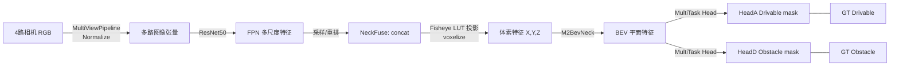

# FastBEV-Fish 模型结构说明

## 总览

FastBEV-Fish 采用多相机输入，通过 2D 主干提取特征、鱼眼 LUT 映射到 BEV，再经 3D neck 和多任务头完成 BEV 语义分割（HeadA: drivable，HeadD: obstacle）

## 数据与标注
- 数据集：synwoodscape 4相机，多视角。
- BEV 标注：预生成掩码，HeadA=可行驶区，HeadD=障碍。
- 配置关键：`GenerateBEVMultitaskTargets`，`with_bev_seg=True`；标注路径在 `ann_info.gt_bev_seg` 等字段中透传。

## 模型组件

### 2D 主干与融合
- **Backbone**：ResNet-50（SyncBN，冻结 stage1）。
- **Neck(FPN)**：4 层输出，每尺度 `out_channels=64`。
- **NeckFuse**：将 6 路视角在通道维拼接 (`64*6=384`)。

### BEV 投影
- **Fisheye LUT**：基于相机内外参预计算索引，支持鱼眼/透视；当前配置关闭磁盘缓存，仅内存使用，避免多进程写冲突。
- **Voxelization**：点云网格尺寸 `n_voxels=[675,650,4]`，体素大小 `[0.35,0.35,1.0]`，范围 `[-50,50]x[-50,50]`。

### 3D Neck（M2BevNeck）
- 输入通道：384（FPN×6视角），体素高度聚合后通过 1×1 conv (in=1024,out=384) 融合。
- 主干：残差块+Conv 下采样，`out_channels=256`，`num_layers=5`，stride=2，输出 BEV 平面特征。

### 多任务头（FisheyeBEVMultiTaskHead）
- 输入：256 通道 BEV 特征。
- 启用头：HeadA(drivable)、HeadD(obstacle)；标线等分支关闭。
- 损失：BCE+加权，drivable `loss_weight=3.0`，obstacle `loss_weight=5.0`，支持 hard negative 挖掘 (`pos_topk_ratio`, `neg_pos_ratio`)。

## 训练与推理流程
1. **加载数据**：MultiViewPipeline 读取 6 路图像，LoadAnnotations3D 加载 BEV 掩码。
2. **特征提取**：ResNet50+FPN -> 每视角多尺度特征。
3. **视角融合**：NeckFuse 拼接 -> 通过鱼眼 LUT 投影到 BEV 体素。
4. **3D Neck**：M2BevNeck 聚合体素，得到 BEV 平面特征。
5. **多任务头**：输出 drivable/obstacle 语义图。
6. **损失计算**：对齐 BEV GT 掩码，BCE/平衡策略。
7. **推理**：同流程，无 GT，直接输出 BEV 语义。

## 关键配置路径
- 模型配置：`configs/nuscenes/fastbev_heada_headD_bev.py`
- 数据 pkl：`work_dirs/nuscenes_infos_train_bev_filtered_exist.pkl` / `val_bev_filtered_exist.pkl`
- BEV 掩码：`work_dirs/nuscenes_bev_masks_full_v1`

## 已知注意点
- LUT 不落盘：`cache_dir=None`，避免 DataLoader 多进程写冲突。
- 数据 Loader 内存：建议 `samples_per_gpu=1`，`workers_per_gpu=1~2` 视机器情况调节。
- 验证无 3D 框时：`ann_info` 判空已修复，确保不再 KeyError。

